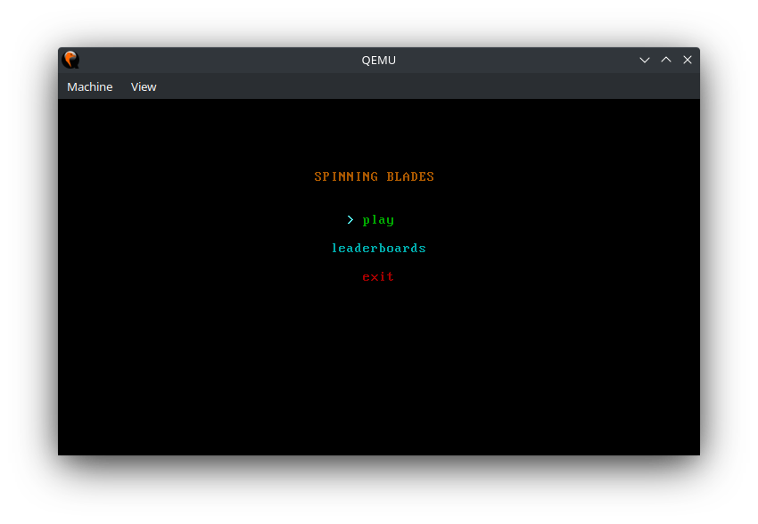
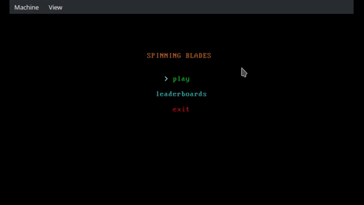
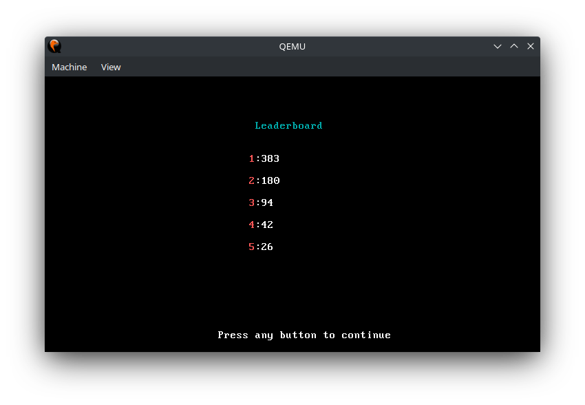

# Spinning-Blades-Assembly-Game
Welcome to Spinning Blades, a fast-paced 2D ASCII assembly game where you pilot a spaceship while dodging spinning blades. As the blades move from right to left, they get faster and more challenging to avoid. Test your reflexes and see how long you can survive in this simple but addictive game.



## Gameplay

##### Game Controls:
- Press directional keys to move by 1 cell.
- Hold directional keys to move faster.

##### GameplayTips:
- Taks some steps forward when you are able to, you will then have the option of moving back when things get faster.
- If you spend too much time at a certain height, the blades will start spawning more frequently at that hight.


## Leaderboard

The game presents a leaderboard you can access from the main menu. The score are **NOT** written to disk, hence you will only be able to compare different 'runs' if the game instance is the same. Once you close the application the scores will be lost.

## How to Play
In order to play the game you first need to clone the repository and navigate to the root folder.
```
git clone https://github.com/T0mexX/spinning-blades-assembly-game.git; cd spinning-blades-assembly-game
```
You will need to have qemu installed on your machine.
```
sudo apt-get install qemu
```
Now you can run the game with the following command (from the root folder).
```
make qemu
```
